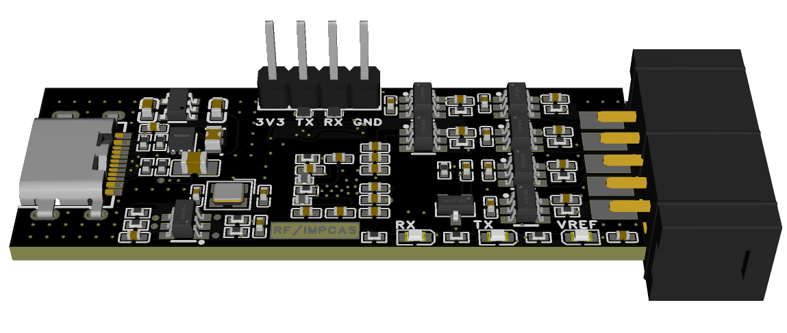

# hw-ftdi-jtag-xilinx

## Version 1
- has bug with the auto-direction level shifter, only works with slow rate
- has manufacturing limit with the jtag & usb track due to JLCPCB limitaion
- has wrong silk print for rx/tx
- BUG: cannot download flash if JTAG f_tck > 1MHz (~5MHz~) (roughly), I really don't know Y, cause the BIT file can be downloaded at 30MHz rate.

### 3d model

<details>

  
  

</details>

### pcb photo

<details>

  

</details>


## Version 2
- replace auto-direction level shifters with fix-direction ones
- satisfy the JLC track to track clearance limit

### 3d model

<details>

  

</details>

### pcb photo

<details>

  

</details>

## Version 3
- remove on board voltage select
- add TVS diodes
- use 10-pin jtag header instead
- use RX/TX LED pin on ftdi chip

### 3d model

<details>

  

</details>

### pcb photo

<details>

  

</details>

## Version 3.1
- replace murata 3pin 0.5% crystal with 4pin 10ppm crystal

### 3d model

<details>

  

</details>

### pcb photo [WIP]

<details>

  

</details>

## Notes
- the murata 12MHz crystal cannot satisfy 30ppm, instead, its precision has only 700ppm.
  - This is the ***root cause*** of all stupid bugs I have encounter so far, FU**!!!
  - I choose to solder a DT-38 crystal instead as a workaround.
  - Version 1/2/3 are all fucked.
  - This murata crystal will be replaced in future version.

## Production
- For linux
  ```bash
  # remove ftdi kernel driver everytime if you plug ftdi in
  sudo rmmod ftdi_sio && sudo rmmod usbserial
  ```
  ```bash
  # otherwise, program_ftdi will be not found
  source /tools/Xilinx/Vivado/2024.2/settings64.sh && vivado
  ```
- Inside vivado
  ```tcl
  # tested withvivado 2024.2
  program_ftdi -write -f FT2232H -s 0000003 -v "RF/IMPCAS" -b "custom" -d "FT2232H JTAG Cable 10P"
  ```