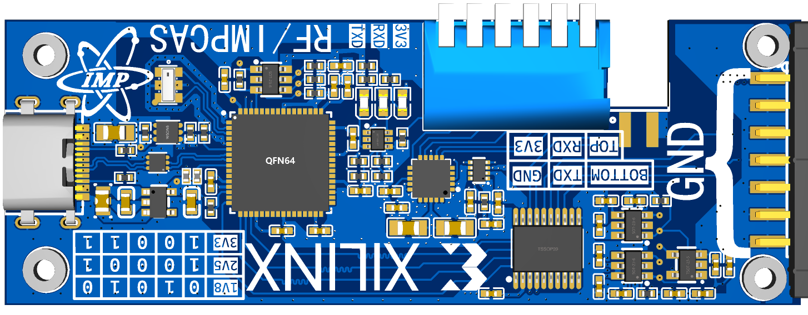
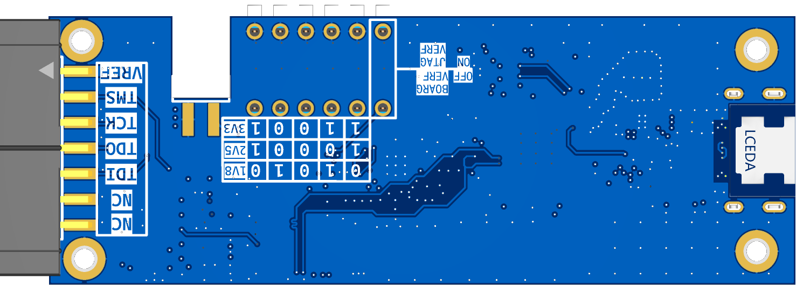
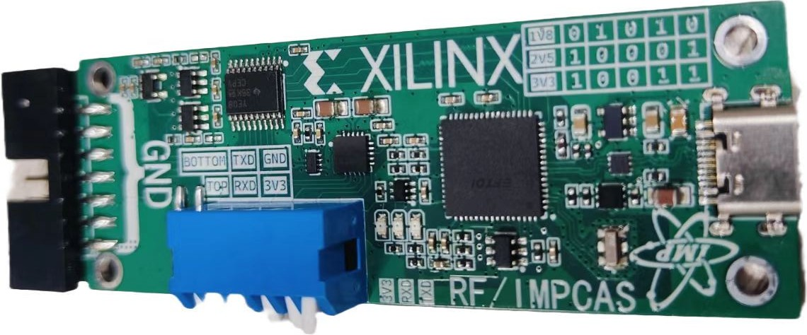
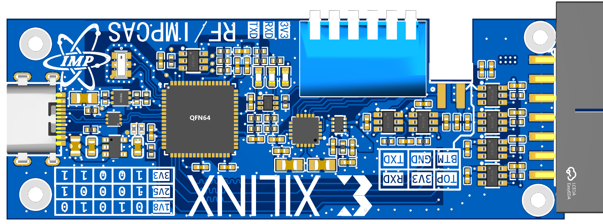
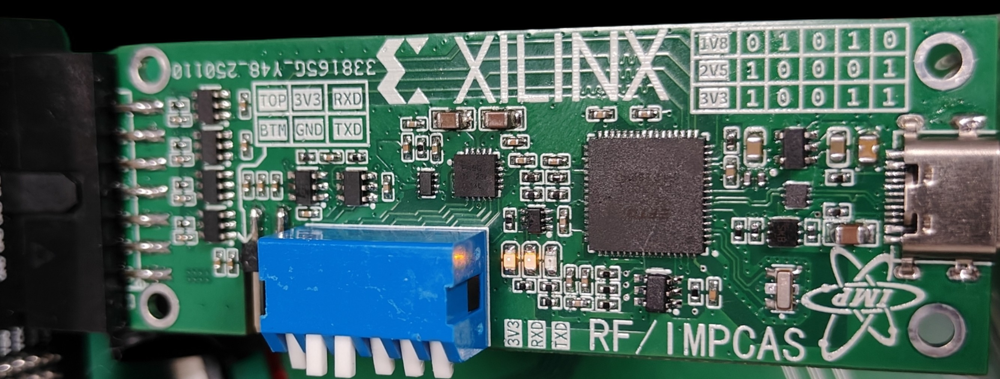
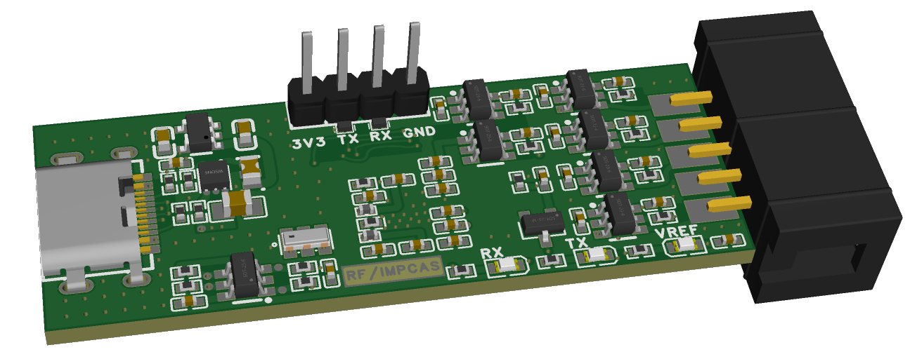
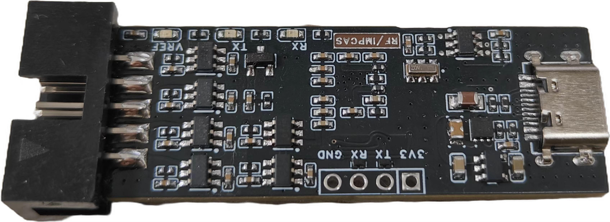

# hw-ftdi-jtag-xilinx

## Version 1
- has bug with the auto-direction level shifter, only works with slow rate
- has manufacturing limit with the jtag & usb track due to JLCPCB limitaion
- has wrong silk print for rx/tx
- BUG: cannot download flash if JTAG f_tck > 1MHz (~5MHz~) (roughly), I really don't know Y, cause the BIT file can be downloaded at 30MHz rate.

### 3d model

  
  

### pcb photo

  

## Version 2
- replace auto-direction level shifters with fix-direction ones
- satisfy the JLC track to track clearance limit

### 3d model

  

### pcb photo

  

## Version 3
- remove on board voltage select
- add TVS diodes
- use 10-pin jtag header instead
- use RX/TX LED pin on ftdi chip

### 3d model

  

### pcb photo

  

